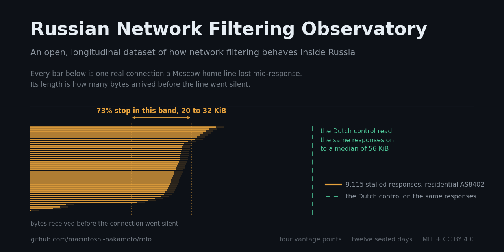
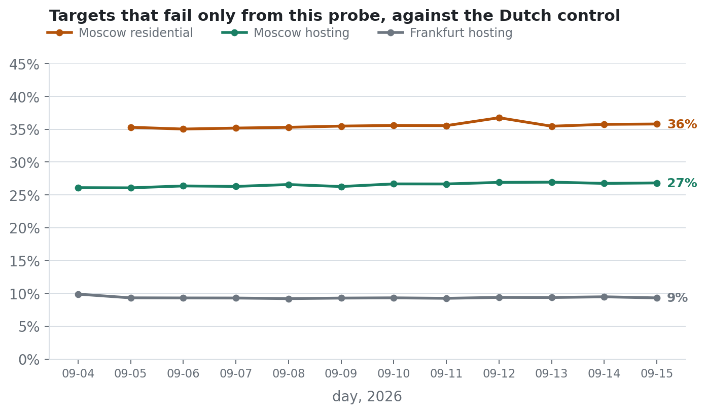
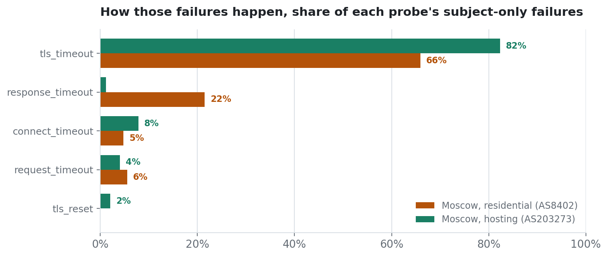
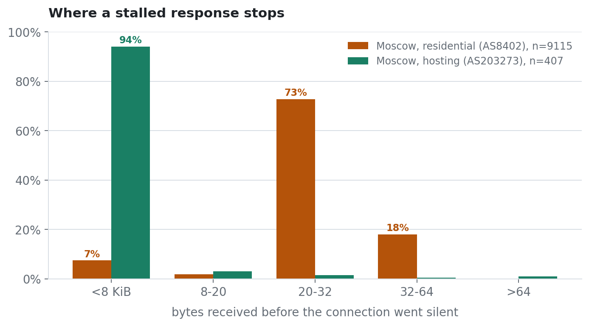

<div align="center">



# Russian Network Filtering Observatory

**An open, longitudinal dataset of how network filtering behaves inside Russia, measured
from several vantage points, with a documented methodology and a published ethics statement.**

[](LICENSE)
[](data/LICENSE)
[](../../actions)
[](probes.yaml)
[](docs/OPERATIONS.md)

</div>

This is a **measurement** project. It observes and records how networks behave. It does
not build, ship or document tools for evading network controls, and none are present in
this repository. See [`docs/ETHICS.md`](docs/ETHICS.md).

---

## The vantage points

| id | role | where | autonomous system | network type |
|---|---|---|---|---|
| `ru-msk-vps` | subject | Moscow | AS203273 NetCrafters | hosting |
| `ru-mow-home` | subject | Moscow | AS8402 Vimpelcom (Beeline) | **residential** |
| `nl-lim-panel` | control | Netherlands | AS200823 MHost | hosting |
| `de-fra-vps` | control, and subject for Russian targets | Frankfurt | AS210644 AEZA | hosting |

All four run the same binary against the same 2,828 targets on the same UTC schedule, so
a Russian measurement and its foreign control share a `run_id` and join on `(run_id, url)`.

---

## Two findings so far

### A hosting vantage point understates residential filtering by about nine points

Every remote measurement platform observes from datacentres. Russian filtering equipment
sits mainly at operators serving subscribers, so that choice is not neutral: against the
same foreign control, in the same slots, a Moscow home line loses about nine points more
of the test list than a Moscow VPS does, and the gap has not moved in twelve days.

<picture>
  <source media="(prefers-color-scheme: dark)" srcset="docs/img/gap-dark.png">
  
</picture>

The mechanism differs too, which is the part a verdict-only dataset cannot show. From
hosting it is almost one thing, a silent drop after the ClientHello. The residential line
adds a second mechanism the VPS practically lacks: the handshake completes, a 200 status
line arrives, and the response stalls.

<picture>
  <source media="(prefers-color-scheme: dark)" srcset="docs/img/mechanisms-dark.png">
  
</picture>

### Those residential stalls stop inside a narrow band

`bytes_read` counts wire bytes received before the connection went silent. For the 9,115
stalls the residential probe lost while the Dutch control read the same responses fine,
73 % stop between 20 and 32 KiB. The hosting probe has 407 comparable rows and 94 % of
them stop under 8 KiB, which is a different shape entirely.

<picture>
  <source media="(prefers-color-scheme: dark)" srcset="docs/img/stalls-dark.png">
  
</picture>

This is the behaviour described on ntc.party as "the 16 KB cut", here with a control and
a distribution rather than an anecdote. It is also not a size rule. Among targets whose
response is 32 KiB or larger, only 16 % stall consistently and the other 84 % deliver the
same volume intact; a stalling target, however, stalls on **100 %** of the days it is
measured, and the failure rate does not move across the day, so it is neither random nor
congestion. Size decides where the connection dies, around 20 to 32 KiB. A host set decides
whether it dies at all.

That host set is not the set that is blocked outright. News is the most filtered category
on this line and the least likely to stall, because 48 % of it is already dropped during
the TLS handshake and never reaches a body. Religion is the mirror image: 79 % succeeds,
4 % is dropped at the handshake, and 13 % is stalled mid-response. The stall is a second
treatment applied to a partly different set, and the hosting probe sees it in 0.3 % of the
same rows. Worked through in [`docs/METHODOLOGY.md`](docs/METHODOLOGY.md) §8.7, computed by
[`analysis/stalls.py`](analysis/stalls.py).

**How solid these numbers are.** Every failure on both Russian probes is measured again
three seconds later. From 2026-09-09, once the retry guard was fixed, 100 % of failures
were retried and the failure reproduced in **96.3 %** of 32,764 residential cases and
96.0 % of 25,592 hosting cases. So these are not one-off observations.

**Caveats that belong next to the numbers.** One household on one operator, so the
residential line is n=1 and cannot speak for Russian broadband in general. Twelve days is
not a season. Between 2026-09-05 and 2026-09-08 the residential probe recorded no retries
at all, because the guard then in use fired on any run losing more than 40 % of the list,
which is that probe's ordinary day. Full discussion, including that mistake and how it was
found, in [`docs/METHODOLOGY.md`](docs/METHODOLOGY.md) §8.

Every figure above is drawn straight from the sealed day files by
[`analysis/figures.py`](analysis/figures.py); run it and you get the same pictures.

---

## Why this exists

Several projects measure Russian network filtering, and each stops short of a different
thing:

- **OONI** collects global web-connectivity data, but does not characterise filtering
  behaviour at the protocol level.
- **GlobalCheck** runs a volunteer sensor network, but exposes a service - "is site X
  reachable now" - rather than a downloadable historical dataset.
- **blockcheck** classifies blocking type well, and is currently unmaintained.
- The tooling on ntc.party is excellent, and it is tooling: no control group, no
  confidence intervals, no ethics statement.

What is missing is a machine-readable longitudinal dataset with a research-grade
methodology, covering both eyeball and hosting networks, that records *how* a connection
died rather than only *that* it died.

The methodological template is Xue, Mixon-Baca, ValdikSS, Ablove, Kujath, Crandall and
Ensafi, *TSPU: Russia's Decentralized Censorship System*, IMC '22.

---

## What it measures, and why not `curl`

The obvious implementation is a shell script around `curl` and its exit code. This one is
not, and the reason is the point of the project.

`curl` exit code 56 means "connection reset by peer". It is returned whether the reset
arrived immediately after the TCP handshake, right after the TLS ClientHello - the first
packet carrying the server name in the clear - or halfway through the response body.
Those are three different filtering mechanisms and `curl` cannot tell them apart.

The agent performs the connection in explicit stages and records where it died, what the
kernel said, and **how many bytes arrived first**:

```json
{"schema":"v1","run_id":"2026-09-04T18:00Z/full","probe":"ru-msk-vps","net":"hosting",
 "asn":"AS203273 NetCrafters OU","target":"www.bbc.com","list":"citizenlab-global",
 "stage":"tls","verdict":"tls_reset","errno":"ECONNRESET","curl_rc":35,
 "t_connect":0.040,"bytes_read":0,"ip_family":"v4"}
```

TCP completed in 40 ms; the connection died during the TLS handshake with a reset and zero
bytes of application data. That shape is consistent with name-based inspection, and it is
distinguishable from the targets in the same run that were silently dropped instead, and
from those that never completed a TCP handshake at all.

`curl_rc` is kept in every row as a compatibility field, so this dataset can still be
compared against curl-based measurements published elsewhere. Full field list:
[`docs/SCHEMA.md`](docs/SCHEMA.md).

---

## Quick start

```bash
go build ./...

# see what one probe would measure, without writing anything
go run ./probe -probe local-test -net eyeball -profile controls -dry-run

# deploy to a probe (idempotent; also upgrades)
python tools/deploy.py root@<host> <probe-id> <hosting|eyeball|mobile>

# collect, verify checksums, validate against the schema, count
./bin/rnfo-collect pull
./bin/rnfo-collect validate
./bin/rnfo-collect stats

# what failed only from one probe, target by target, in one slot
./bin/rnfo-collect compare -slot 2026-09-15T18:00Z/full \
    -subject ru-mow-home -control nl-lim-panel

# redraw the figures in this README
python analysis/figures.py
```

Full detail in [`docs/OPERATIONS.md`](docs/OPERATIONS.md).

---

## Layout

```
probe/          measurement agent; lists/ are pinned and compiled into the binary
responder/      controllable endpoint: any SNI, exact response sizes, chosen pacing
collector/      pull, verify checksums, validate against the schema and registry
internal/       schema, failure classification, targets, identity, registry
analysis/       the scripts that draw every figure in this README
docs/           methodology, ethics, schema, operations
probes.yaml     the probe registry; a row with an unregistered probe id is invalid
```

---

## Design rules worth knowing before reading the data

- **Every attempted target produces a row, including failures.** A missing row means the
  probe was down, and the run records prove it.
- **Run ids are the scheduled slot, not the start time**, and every probe fires on the
  same UTC schedule with a one-second accuracy window.
- **`healthy: false` runs must be discarded.** Ten connectivity controls, half of them
  domestic, run at the start of every measurement. If they fail, the probe was off the
  network and the rest of that run says nothing about filtering.
- **Hosting is not eyeball.** A datacentre probe and a household probe measure different
  networks, and pooling them into one "Russia" number is a mistake the `net` field exists
  to prevent. The first finding above is what that mistake would cost.
- **IPv4 only, by decision.** Probes differ in whether they have working IPv6, and letting
  the resolver choose would silently make each probe a different experiment.
  `no_address_family` is a distinct verdict, never confused with a block.

---

## Open defects

Listed here rather than in an appendix, because they bound what the data can support.

1. **One residential vantage point, one household, one operator.** Everything the first
   finding says about subscriber networks rests on a single line in a single flat. A
   second household on a different operator is the cheapest way to make it an argument
   rather than an observation.
2. **The AS comparison has a sample size of two**, and the second foreign host shares an
   upstream with the Russian probe. Its failures toward Russian destinations (9.3 % of the
   list) make it a subject rather than a control for those targets.
3. **The primary control is not a dedicated machine.** It runs a production web service;
   acceptable because the agent is outbound HTTP only, and recorded on its registry entry.
4. **Runs are paired by slot, not synchronised.** A Russian run takes tens of minutes
   because failures wait out their timeouts; a control finishes in two. Rows join on
   `(run_id, url)` and timestamps give the skew - fine for reachability, not for anything
   at packet granularity.
5. **The responder is unreachable by TCP from both Russian probes**, so the SNI experiment,
   Tier 2 packet capture and Tier 3 transports are all waiting on a responder host at a
   provider whose prefix Russian networks pass TCP to.

Full discussion in [`docs/METHODOLOGY.md`](docs/METHODOLOGY.md) §7 and §10.

---

## Ethics in one paragraph

Targets are the public Citizen Lab `global` and `ru` test lists, pinned by commit hash,
plus endpoints this project owns. Nothing else is ever contacted: no scanning, no
enumeration. One request per target per probe per six hours. No response bodies are
stored, only a hash and the page title. No personal data is collected from anyone. The
probes' own addresses are never written to the dataset - the validator rejects rows that
contain one. Probes on machines the project does not own require recorded consent, and the
registry loader refuses to mark such a probe active without it. Full statement:
[`docs/ETHICS.md`](docs/ETHICS.md).

To have a host excluded from measurement, or to ask anything about the data, open an issue.
Exclusion requests are honoured without argument and recorded in
[`docs/CHANGELOG-lists.md`](docs/CHANGELOG-lists.md), so the resulting gap in the data is
visible and explained.

---

## Licence, author, contact

Code: MIT ([`LICENSE`](LICENSE)). Data: CC BY 4.0 ([`data/LICENSE`](data/LICENSE)). A DOI
will be issued for the dataset on first release and recorded here.

Author and maintainer: **freetoshi-nakamoto**. Questions, corrections and requests to be
excluded from measurement: open an issue on this repository.
